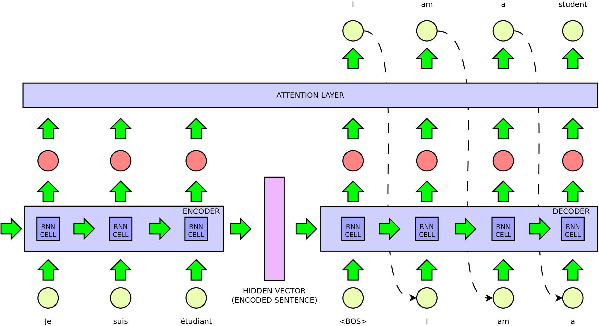

# Neural Machine Translation with Attention
WORK IN PROGRESS
## Description
Easymt is a small framework for neural machine translation.



## Quickstart


## Synopsis
Easymt has 9 functions:

### Split
Preprocess a TSV separated file containing aligned sentences in 2 languages. The Script will produce one file for each language. The files will be automatically saved in the ``` data/``` directory and will have the same name as the original file. The two languages will be saved as ```.l1``` and ```.l2``` as endings.

```python easymt.py split PATH/TO/FILE```

### Clean
This step will remove xml tags from the corpus and pass it through the [clean data script from the moses project](https://github.com/moses-smt/mosesdecoder/blob/master/scripts/training/clean-corpus-n.perl). The data cleaner script will also enforce a maximum length for the training sentences (default: 50)

```python easymt.py clean PATH/TO/FILE1 PATH/TO/FILE2 --len N```

### Preprocess

Preprocess a dataset by:
* normalizing punctuation
* tokenizing the text
* truecasing
* spplying subword encoding

```python easymt.py clean PATH/TO/FILE1 --language LANG --bpe N```

### Split data set
Given the number of lines for the train, evaluation and test data set, this script will take two files as input and extract the desired amount  of lines to create the data sets. Files will be saved in the ```data/````directory.

```python easymt.py clean PATH/TO/FILE1 PATH/TO/FILE2 --train N --eval N --test N```

### Build Vocabulary
This script will go over 2 files and create 2 vocabulary files for the model.
It is possible to restrict the number of lines and/or the minimum frequency for a token to be included in the vocabulary. The ending of the file (es. ```.en``` will be used as language of the file)

```python easymt.py clean PATH/TO/FILE1 PATH/TO/FILE2 --n_sample N --min_freq N ```

### Convert to byte
This function will read the entire train data set and chunk it into byte encoded files to reduce memory usage during training. By default, each file will contain 100 batches. 

```python easymt.py convert-to-byte PATH/TO/CONFIG.INI```

### Train
Train a sequence to sequence model for machine translation. At the end of training both the encoder and the decoder are saved in a seq2seq-object that can be used for translation.  
By default the training process uses the concept of teacher forcing with a possibility of 50%. This means that at each step the decoder is either fed the previous prediction or the real target word to predict the next word. This is done to speed up training. To disable this option use the ```--no-teacher``` flag.
Training can be resumed with the ```--resume``` flag by giving as input the path to a previously saved seq2seq model.
If the dataset was converted to bytes, use the ```--batched``` option.

```python easymt.py train PATH/TO/CONFIG.INI```

### Translate
Text files will be translated using beam search (the size of the beam can be given as argument, default:5).

```python easymt.py translate PATH/TO/FILE.TXT PATH/TO/MODEL --beam N```

### Normalize
Detokenize a translated file. If ```--subword````is used, the script will also undo subword splitting.

```python easymt.py normalize PATH/TO/REFERENCE```


#### Evaluate
Compute BLEU score based on a reference translation.

```python easymt.py evaluate PATH/TO/REFERENCE PATH/TO/TRANSLATION```