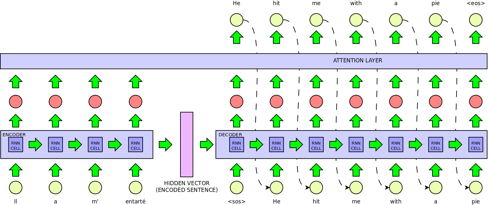

# Neural Machine Translation with Attention
WORK IN PROGRESS
## Description
Implementation of a sequence to sequence model with attention for machine translation.


## Synopsis
Easynmt has 5 functions:
```
usage: easymt.py [-h] {split,preprocess,build-vocab,train,translate,evaluate} ...

positional arguments:
  {split,preprocess,build-vocab,train,translate,evaluate}
    split               preprocess a TSV file
    preprocess          preprocess a corpus
    build-vocab         build a vocabulary from files
    train               train a new model
    translate           translate a file
    evaluate            compute BLEU score

optional arguments:
  -h, --help            show this help message and exit
```

### Split
preprocess a TSV separated file containing aligned sentences in 2 languages

```
usage: easymt.py split [-h] PATH

positional arguments:
  PATH        Path to the TSV file

optional arguments:
  -h, --help  show this help message and exit
```

```
$ python mt.py split PATH/TO/TSV-FILE
```


### Preprocess

```
usage: easymt.py preprocess [-h] [--single SINGLE] PATH

positional arguments:
  PATH             Path to the configuration file

optional arguments:
  -h, --help       show this help message and exit
  --single SINGLE  only preprocess this file
```

Preprocess a dataset (both languages), this includes:
* remove xml tags
* normalization
* tokenization
* truecasing
* bpe splitting


By default this step will take advantage of concurrency to process the two languages
at the same time.
With the ```--single``` option it is possible to pass as an argument a single file
which will be processed. This is useful to prepare a document to be translated.
The source language in the configuration file will be considered the language of
the document.

```
$ python mt.py split config.ini
```

```
$ python mt.py split config.ini --single PATH/TO/FINGLE/FILE
```

### Build Vocabulary
```
usage: easymt.py build-vocab [-h] [--n_sample N] PATH

positional arguments:
  PATH          Path to the configuration file

optional arguments:
  -h, --help    show this help message and exit
  --n_sample N  number of lines used to build vocabulary (0 = full corpus - default: 0)
```

### Train
Train a sequence to sequence model for machine translation. At the end of training both the encoder and the decoder are saved in a seq2seq-object that can be used for translation.  
By default the training process uses the concept of teacher forcing with a possibility of 50%. This means that at each step the decoder is either fed the previous prediction or the real target word to predict the next word. This is done to speed up training. To disable this option use the ```--no-teacher``` flag.

```
usage: easymt.py train [-h] [--resume RESUME] PATH

positional arguments:
  PATH             Path to the configuration file

optional arguments:
  -h, --help       show this help message and exit
  --resume RESUME  path to model to resume training
```

```
$ python mt.py train config.ini
```
```
$ python mt.py train config.ini --no-flag
```

### Translate
Translate a file using a pretrained model. The file must be preprocessed using the [preprocess](#preprocess) function with the ```--single``` option.

```
usage: easymt.py translate [-h] [--beam N] FILE MODEL

positional arguments:
  FILE        path to file to translate
  MODEL       path to model

optional arguments:
  -h, --help  show this help message and exit
  --beam N    Size of search beam (default: 5)
```

```
$ python mt.py translate PATH/TO/DOCUMENT PATH/TO/MODEL
```
